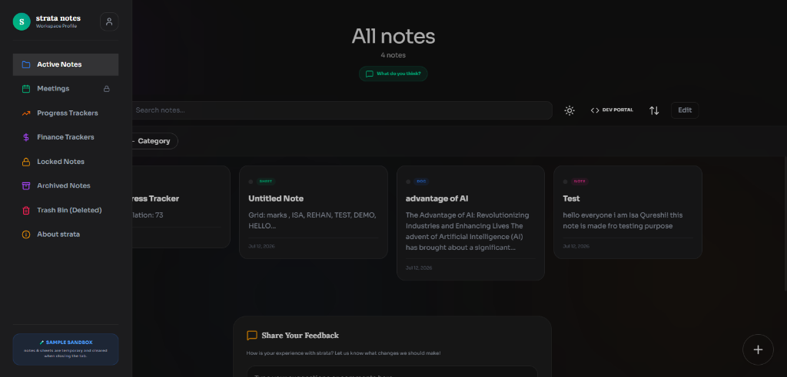
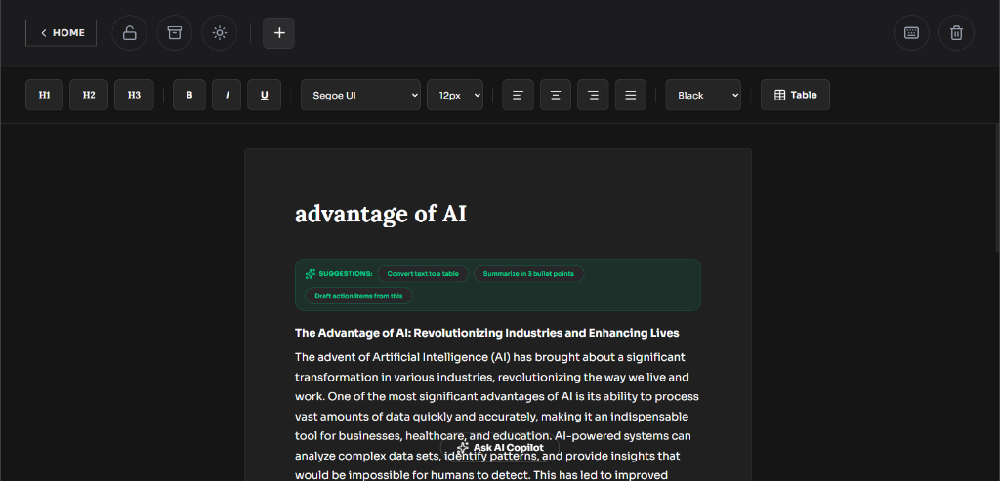
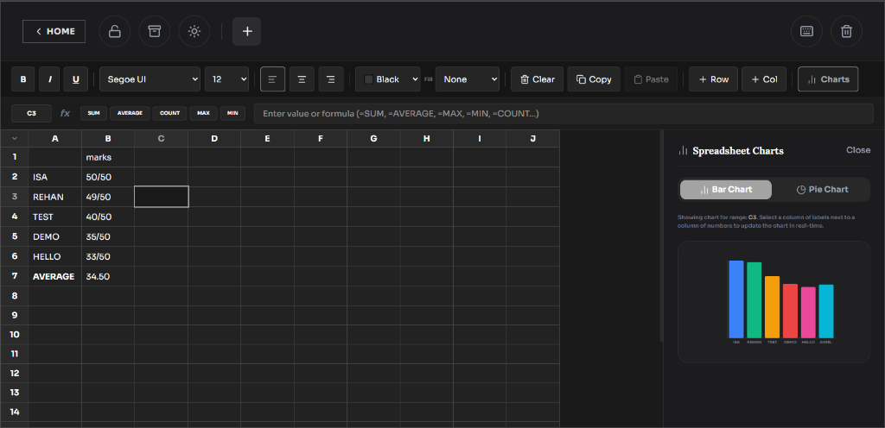
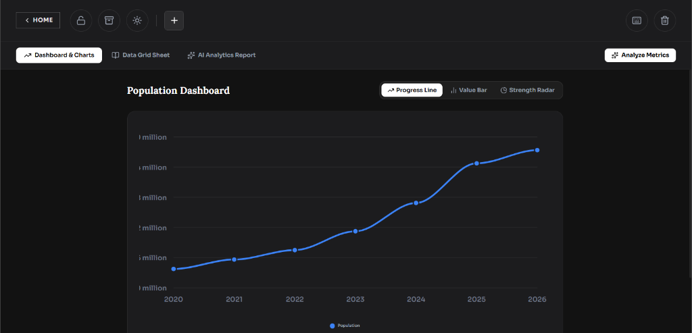
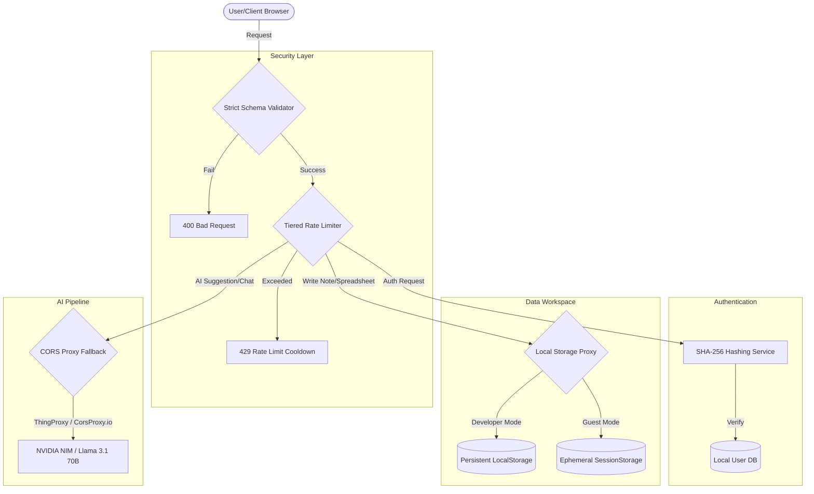

# strata — Agentic & Minimalist Notes Workspace

**strata** is a premium, minimalist, local-first offline workspace application built with React, TypeScript, and Vite. It combines elegant typography, rich dark aesthetics, and robust local tools including rich text notes, progress trackers, spreadsheets, drawing canvas, and a local AI Copilot.

This repository is published as **strata-agentic-notes** representing the fully audited, production-ready release of strata.

---

## 👥 Developers
*   **Isa Qureshi**
*   **Ansari Rehan**

---

## 🖼️ Application Showcases

### 🎛️ Active Notes Workspace


### 📝 AI-Powered Rich Text Editor


### 📊 Spreadsheet


### 📈 Metrics Analytics & Progress Charts


---

## 🚀 Feature Highlights (Short Summary)

*   **Active Notes Workspace**: A centralized hub to search, organize, pin, and categorize notes with real-time word/character counts.
*   **AI Copilot**: An intelligent text companion for summarizing, brainstorming, and writing assistance, preconfigured for NVIDIA NIM and Google Gemini APIs.
*   **Progress Trackers**: Interactive progress line graphs, value bars, and strength radar charts to visualize data trends and milestones.
*   **Spreadsheet Workspace**: Local sheets with dynamic formula evaluations (=SUM, =AVERAGE), custom rows, columns, and data grid rendering.
*   **Locked Notes**: End-to-end local passcode protection to secure and hide sensitive note entries in a password-protected vault.
*   **Meetings & Auto-Briefings**: Proactive briefing preparation templates and meeting workspaces gated for developer administrative sessions.
*   **Developer Portal**: Administrative suite for registration approvals, passcode recovery, and log management.
*   **OWASP Security Hardening**: Offline user authentication secured via browser-native SHA-256 Web Crypto hashing, tiered request rate limiting, and prompt injection filters.

---

## 📊 System Architecture & Data Flow



---

## 🛠️ Installation & Getting Started

### Prerequisites
*   [Node.js](https://nodejs.org/) (v18.0.0 or higher)

### Setup
1. Clone this repository:
   ```bash
   git clone https://github.com/isaqureshi14/strata-agentic-notes.git
   cd strata-agentic-notes
   ```
2. Install dependencies:
   ```bash
   npm install
   ```
3. (Optional) Configure environment variables. Duplicate `.env.example` as `.env` and fill in your keys:
   ```bash
   cp .env.example .env
   ```
4. Start the local development server:
   ```bash
   npm run dev
   ```
5. Build production bundle assets:
   ```bash
   npm run build
   ```

---

## 📄 License
This project is licensed under a proprietary Non-Commercial Educational License. See `LICENSE` for details.
Copyright (c) 2026 Isa Qureshi, Ansari Rehan.
